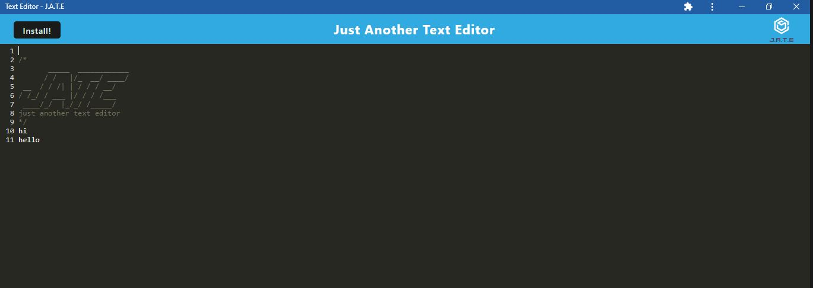

# Text Editor

## Description
My motivation behind creating the text editor was to make it easier for users to make changes and save the text, even offline as it can be installed. This app follows Progressive Web Application criteria. 

## Github Repo link: 
  https://github.com/Nehaps29/socialnetworkwithmongoose

## Heroku link: 

  https://lit-mountain-41070-3310543b3f22.herokuapp.com/

## Picture of App
  
  

## Table of Content

  - [Installation](#installation)
  - [Usage](#usage)
  - [Contribution Details](#contribution-details)
  - [Test Instructions](#test-instructions) 
  - [License](#licenses)
  - [Contact](#contact)
  
  

## Installation: 
    css-loader, babel-loader, html-webpack-plugin, webpack-pwa-manifest, workbox-webpack-plugin

## Usage:
  to change, save text online or offline

## Contribution Details: 
    
    Neha Sabannavar, Rutgers TA, Xpert Learning Assistant 
    https://developer.mozilla.org/en-US/docs/Web/API/IndexedDB_API
    https://developer.mozilla.org/en-US/docs/Mozilla/Add-ons/WebExtensions/manifest.json

## Test Instructions: 
   Command to run the script : 
   - npm i
   - npm start

## Licenses: 
  MIT
      
  https://opensource.org/licenses/MIT 

  
## Contact: 
  Below mentioned is my github profile link 

  ## Github: https://github.com/nehaps29
  

  